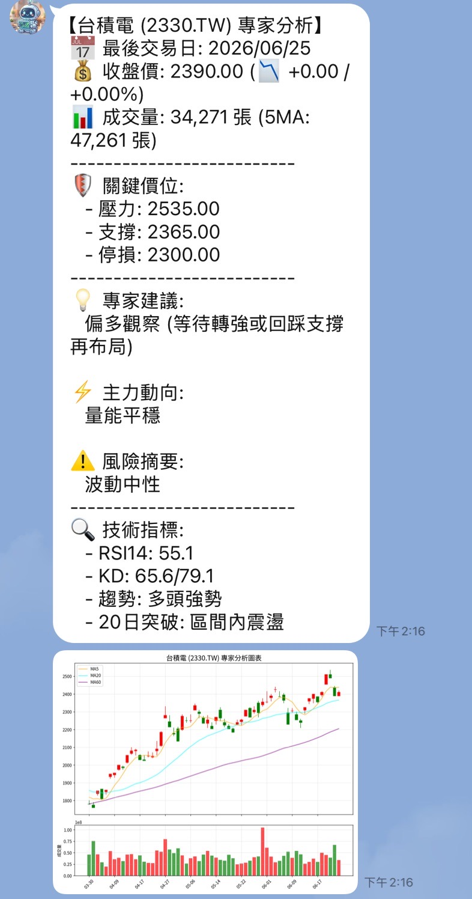

# TradeOracle 自動化股票分析系統

TradeOracle 是一個基於 Python 的全自動化台股分析工具。系統能自動抓取歷史行情與籌碼數據，計算多維度技術指標（均線、RSI、KD、MACD、ADX/DI 等），並透過專家規則引擎進行即時判讀，提供具備操作建議、風險摘要與支撐觀察的分析報告。

本專案採用最現代化的**「雙核心」**架構，提供：**Web 視覺化看板 (Vue 3 SPA)** 以及 **Line Bot 即時對話機器人**，滿足無論是在電腦前深度看盤，還是在外用手機秒查的需求。



## 🌟 核心功能 (Key Features)

* **多重數據來源自動備援**：整合 `twstock` (盤中即時報價)、`yfinance` (歷史行情)、證交所/櫃買中心官方 API，以及 FinMind (備援)，確保資料的準確性與穩定性。
* **專家分析引擎**：
  * **趨勢與動能**：計算 SMA、RSI、KD、MACD。
  * **趨勢強度與風險**：使用 ADX/DI 判斷趨勢強度，利用 ATR (真實波動幅度) 衡量風險與設定動態停損。
  * **籌碼與量價分析**：判斷主力進場/出貨訊號、量價背離、突破與跌破狀態。
* **智慧快取機制 (Smart Cache)**：
  * 針對盤中與盤後設計不同的快取策略（如盤後快取自動延長至隔日開盤），並支援 Line Bot 的 Firestore 快取，大幅減少不必要的 API 請求與運算資源。
* **雙核心表現層 (Presentation Layer)**：
  * **Web 儀表板 (Vue SPA)**：提供深色毛玻璃 (Glassmorphism) 風格的超高質感操作介面，表格化陳列技術指標與關鍵價位。
  * **Line Bot**：基於 `Flask` 開發，支援高併發查詢，透過文字與靜態圖片傳遞第一手投資情報。
* **互動式圖表報告**：自動產生 `Plotly` 高品質技術圖表 (HTML 格式)，包含 K 線圖、均線、成交量與各項技術指標子圖，並可透過網頁端一鍵展開。

## 🛠️ 系統架構 (Architecture)

* **Data Provider (數據接入層)**：動態讀取 `twstock.codes` 驗證代碼，並負責抓取、清洗並整併來自多個 API 的盤中與歷史數據。
* **Analytics Engine (運算引擎層)**：利用 `pandas_ta` 計算技術指標，並套用專家規則進行狀態判定與多空訊號評估。
* **Web API & Presentation (介面層)**：透過 Flask RESTful API (`web_api.py`) 將資料餵給 Vue 3 前端；或透過 `line_bot_app.py` 直接回覆 Line 訊息。

## 💻 技術棧 (Tech Stack)

* **核心語言**: Python 3.10+
* **數據處理與運算**: `pandas`, `numpy`, `pandas_ta`
* **金融數據 API**: `yfinance`, `twstock`, 證交所 API
* **Web 前端 (Vue Dashboard)**: `Vue 3`, `Vite`, `axios`, `lucide-vue-next`
* **Web 後端 (API & Line Bot)**: `Flask`, `flask-cors`, `gunicorn`, `google-cloud-firestore`
* **視覺化圖表**: `Plotly` (互動圖表), `matplotlib` (Line Bot 靜態圖)
* **雲端與部署**: Docker, GCP Cloud Run, Google Cloud Storage, Secret Manager

## 🚀 安裝與執行 (Installation & Usage)

### 1. 系統需求與安裝

請確保您的電腦已安裝 **Python 3.10+** 與 **Node.js (npm)**。

```bash
# 安裝 Python 後端依賴
pip install -r requirements.txt

# 安裝 Vue 前端依賴 (首次執行)
cd frontend
npm install
cd ..
```

### 2. 啟動系統 (本地看盤)

我們為 Windows 使用者提供了超便利的一鍵啟動腳本範本。
請先將根目錄下的 `start.bat.sample` 重新命名（或複製）為 **`start.bat`**。
接著只要雙擊 `start.bat`，系統便會：
1. 自動開啟背景 API 伺服器 (Port 5000)
2. 自動啟動 Vue 開發伺服器 (Port 5173)
3. 自動開啟預設瀏覽器進入您的專屬看盤儀表板！

*(註：為了安全與版控，`.bat` 執行檔已加入 `.gitignore` 不會被上傳)*
> 終端機 A: `python web_api.py`
> 終端機 B: `cd frontend && npm run dev`

### 3. 啟動 Line Bot (本地測試)

```bash
python line_bot_app.py
```
*(註：需在根目錄配置 `.env` 檔案填寫 `LINE_CHANNEL_SECRET` 與 `LINE_CHANNEL_ACCESS_TOKEN`)*

## 🐳 Docker 部署 (Docker Deployment)

本專案內建 `Dockerfile`，您可以輕鬆地將 Line Bot 服務打包成容器執行。

### 部署步驟

1. **建立映像檔 (Build Image)**：
   在專案根目錄下執行：
   ```bash
   docker build -t trade-oracle-bot .
   ```

2. **執行容器 (Run Container)**：
   執行時請帶入包含 LINE 金鑰的 `.env` 檔案，並將預設的 8080 埠號對應到主機：
   ```bash
   docker run -d -p 8080:8080 --env-file .env trade-oracle-bot
   ```

## ☁️ GCP 部署 (Deploying Line Bot to Cloud Run)

支援將 Line Bot 部署至 Google Cloud Run，搭配 Firestore (無伺服器快取) 與 Cloud Storage (儲存圖表)。

請複製 `deploy_line_bot.bat.sample` 為 `deploy_line_bot.bat`，修改裡面的 GCP 專案參數後執行即可一鍵部署上雲，並使用取得的 HTTPS 網址完成 Webhook 綁定。

## 📂 專案結構簡介

* `data.py`: 核心資料抓取與動態代碼驗證模組。
* `signals.py`: 負責技術指標計算與專家規則判讀。
* `presentation.py`: 負責 Plotly 圖表生成與 Line Bot 靜態圖表繪製。
* `web_api.py`: **[核心]** Flask REST API，串接後端邏輯與前端 Vue 畫面。
* `frontend/`: **[核心]** Vue 3 SPA 前端程式資料夾。
* `start.bat`: **[工具]** 本機一鍵雙開前後端並啟動瀏覽器腳本。
* `line_bot_app.py`: Line Bot 雲端服務主程式。

## 📝 授權與注意事項

* 本專案抓取之金融數據僅供參考與學術研究使用，不構成任何投資建議。
* 由於依賴多個外部 API，請注意抓取頻率，避免觸發 Rate Limit 封鎖。
